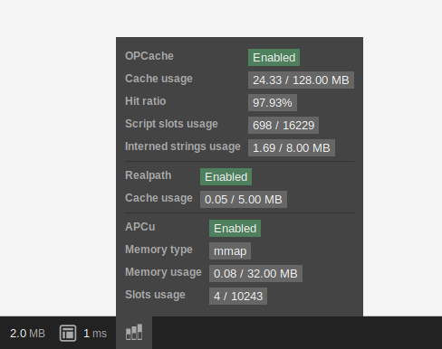

## PablokCacheStatsBundle

### Installation

```bash
composer require --dev pablok/cache-stats-bundle
```

In case you don't use Symfony Flex please add this bundle to `AppKernel.php`
```php
<?php
// app/AppKernel.php

public function registerBundles()
{
    // ...
    if (in_array($this->getEnvironment(), array('dev', 'test'))) {
        // ...
        $bundles[] = new PabloK\CacheStatsBundle\PabloKCacheStatsBundle();
    }
}
``` 

### Example


### License

MIT
